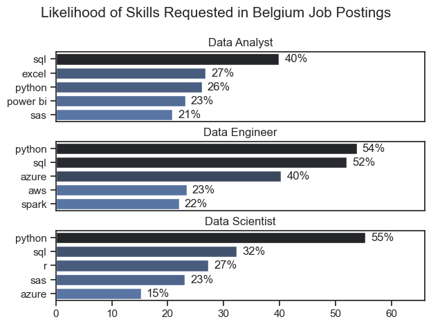

# Overview

Welcome to my analysis of the job market, focusing on data analyst roles in the context of Belgium. The project delves into the top-paying and in-demand skills to help find optimal job opportunities for data analysts.

The data is sourced from Luke Barousse's dataset on Hugging Face. It contains detailed information on job titles, salaries, locations, and essential skills.

# The Questions

Below are the questions which are addressed in the project:
1) What are the most in-demand skills for the top 3 most popular data roles?
2) How are in-demand skills trending for Data Analysts?
3) How well do jobs and skills pay for Data Analysts?
4) What are the optimal skills for data analysts to learn? (High Demand AND High Paying)

# Tools I used

I have harnessed the capabilities of several key tools:
- Python: The backbone of the analysis, allowing me to analyze the data and find critical insights. I also used the following Python libraries:
    - Pandas Library (data analysis);
    - Matplotlib Library (data visualization);
    - Seaborn Library (advanced visualization).
- Jupyter Notebooks: Tool used to run Python scripts and include notes and analysis.
- Visual Studio Code: IDE to execute Python scripts.
- Git & GitHub: Essential for version control and share Python code and analysis, ensure collaboration.

# Data Preparation and Cleanup

This section outlines the steps taken to prepare the data for analysis, ensuring accuracy and usability.

## Import & Clean Up Data

I start by importing necessary libraries and loading the dataset, followed by initial data cleaning tasks to ensure data quality.

```python
# Importing Libraries
import ast
import pandas as pd
import seaborn as sns
from datasets import load_dataset
import matplotlib.pyplot as plt  

# Loading Data
dataset = load_dataset('lukebarousse/data_jobs')
df = dataset['train'].to_pandas()

# Data Cleanup
df['job_posted_date'] = pd.to_datetime(df['job_posted_date'])
df['job_skills'] = df['job_skills'].apply(lambda x: ast.literal_eval(x) if pd.notna(x) else x)
```

## Filter Belgian Jobs

To focus my analysis on the Belgian job market, I apply filters to the dataset, narrowing down to roles based in Belgium.

```python
df_US = df[df['job_country'] == 'Belgium']
```

# The Analysis

## 1. What are the most demanded skills for the top 3 most popular data roles?
#
To find the most demanded skills for the top 3 most popular data roles. I filtered out those positions by which ones were the most popular, and got the top 5 skills for these top 3 roles. This query highlights the most popular job titles and their top skills, showing which skills I should pay attention to depending on the role I'm targeting.

View my notebook with detailed steps here: [2_Skill_Demand.ipynb](2_Skills_Demand.ipynb)


### Visualize Data
#
```python
fig, ax = plt.subplots(len(job_titles), 1)

sns.set_theme(style='ticks')

for i, job_title in enumerate(job_titles):
    df_plot = df_skills_perc[df_skills_perc['job_title_short'] == job_title].head(5)
    sns.barplot(data=df_plot, x='skill_percent', y='job_skills', ax=ax[i], hue='skill_count', palette='dark:b_r')

```

### Results
#


### Insights
#

- Python is highly versatile skill, highly demanded across all three roles but most prominently for Data Scientists (55%) and Data Engineers (54%).

- SQL is the most requested skill for Data Analysts, with 40% of job postings mentioning it.

- Data Engineers require more specialized technical skills (AWS, Azure, Spark) compared to Data Analysts and Data Scientists who are expected to be proficient in more general data management and analysis tools (Excel, Power BI).

#

## 2. How are in-demand skills trending for Data Analysts?

### Visualize Data

```python
sns.lineplot(data=df_plot, dashes=False, palette='tab10')
sns.set_theme(style='ticks')
sns.despine()

from matplotlib.ticker import PercentFormatter
ax = plt.gca()
ax.yaxis.set_major_formatter(PercentFormatter())

```

### Results


*Line graph visualizing the trending top skills for Data Analysts in Belgium in 2023.*

### Insights:
- SQL remains the most demanded skill throughout almost the whole year, although it shows volatility throughout the same period.

- Excel experienced a significant increase during the Feb-Jun period, before decreasing, however it has surpassed Python by the end of the year.

- Power BI has started relatively low in January, however it has ended the year as the most demanded skill thanks to a spectular soar in December.

#

## 3. How well do jobs and skills pay for Data Analysts?

### Salary Analysis for Data Nerds

#### Visualize Data

```python
sns.boxplot(data=df_Belgium_top6, x='salary_year_avg', y='job_title_short', order=job_order)
sns.set_theme(style='ticks')

ticks_x = plt.FuncFormatter(lambda y, pos: f'${int(y/1000)}K')
plt.gca().xaxis.set_major_formatter(ticks_x)
plt.show()

```
#### Results


#### Insights
-There is a significant variations in salary ranges across different job titles, yet the Belgian sample appears to be biased (likely due to its small size) where Senior roles have lower salaries than Junior ones.
-We add the US to our analysis where the sample is larger and is likely give a clearer picture of the reality.
-Senior roles offer higher median salaries than their Junior counterparts. However, not all Senior roles outperform all Junior counterparts in terms of salary; as Data Engineer or Data Scientist have higher median salary than the Senior Data Analyst role.

### Highest Paid & Most Demanded Skills for Data Analysts
#### Visualize Data

```python
fig, ax = plt.subplots(2,1)

#Top 10 Highest Paid Skills for Data Analysts
sns.barplot(data=df_DA_top_pay, x='median', y=df_DA_top_pay.index, ax=ax[0], hue='median', palette='dark:b_r')

#Top 10 Most In-Demand Skills for Data Analysts
sns.barplot(data=df_DA_skills, x='median', y=df_DA_skills.index, ax=ax[1], hue= 'median', palette='light:b')

plt.show()

```

#### Results


#### Insights
- Top graph shows that specialized skills like aws and bigquery are associated with higher salaries; this suggests that advanced technical skills can increase earning potential.

- Bottom graph highlights that foundational skills like Excel, SQL are the most in-demand, even though they may not offer the highest salaries. This demonstrates the importance of those core skills for employability in data analysis roles.

- There is a clear distinction between the skills that are highest paid and those that are the most in-demand. Data Analysts aiming to maximize their career potential should consider developing a diverse skill set that includes both high-paying specialized skills and widely demanded foundational skills.

#

## 4. What is the most optimal skill to learn for Data Analysts?

#### Visualize Data

```python
from adjustText import adjust_text
import matplotlib.pyplot as plt

sns.scatterplot(
    data=df_plot,
    x='skill_percent',
    y='median_salary',
    hue='technology'
)
plt.show()
```

#### Results


*A scatter plot visualizing the most optimal skills (high paying & high demand) for data analysts in the US.*

#### Insights

- The scatter plot shows that most of the 'cloud' skills tend to cluster at higher salary levels compared to other categories, indicating that expertise in cloud technologies might offer greater salary benefits in the data analytics field.

- Programming skills such as SQL are prevalent in job postings, and come next to cloud technology skills both in terms of pay and demand.

- Analyst tools, including Power BI and Excel, are also signficantly in demand and offer competitive salary; showing that visualization and data analysis software are crucial for current data roles. This category not only offers competitive salaries, but is also versatile across different types of data tasks.

# What I learned

Throughout this project, I deepened my understanding of both the data analyst job market and the syntax and capabilities of Python, getting acquainted with Jupyter Notebook Environment was also a new and valuable experience. 
In addition, there are other interesting aspects which need to be mentioned:
- Active use of popular libraries such as Pandas, Seaborn and Matplotlib helped me in the process of complex data analysis.
- Understanding the importance and relevance of data cleaning as a crucial step before data analysis.
- Strategic skill analysis as part of studying the job market. Understanding the relationship between skill demand, salary, and job availability allows for more strategic career planning in the tech industry.

# Insights
This project provided several general insights into the data job market for analysts:
- Skill Demand and Salary Correlation: There is a clear correlation between the demand for specific skills and the salaries these skills command. Advanced and specialized skills like Python, but also in cloud technologies like Azure, aws lead to higher salaries.
- Market Trends: There are changing trends over time in skill demand, highlighting the dynamic nature of the data job market.
- Economic Value of Skills: Understanding which skills are both in-demand and well-compensated can guide data analysts in prioritizing learning to maximize their economic returns.

# Challenges I Faced
- Data Inconsistencies: Handling missing or inconsistent data entries requires careful consideration and thorough data-cleaning techniques to ensure the integrity of the analysis (e.g. resorting to US data when the Belgian sample seemed to be limited in size).
- Complex Data Visualization: Designing effective visual representations of complex datasets was challenging.
- Balancing Breadth and Depth: Deciding how deeply to dive into each analysis while maintaining a broad overview of the data landscape.

# Conclusion
Upgrading Python skills while exploring the data analyst job market simultaneously has been incredibly informative. The insights I got enhance my understanding and provide actionable guidance for anyone looking to advance their career in data analytics. As the market continues to change, ongoing analysis will be essential to stay ahead in data analytics. This project is a good foundation for future explorations and underscores the importance of continuous learning and adaptation in the data field.